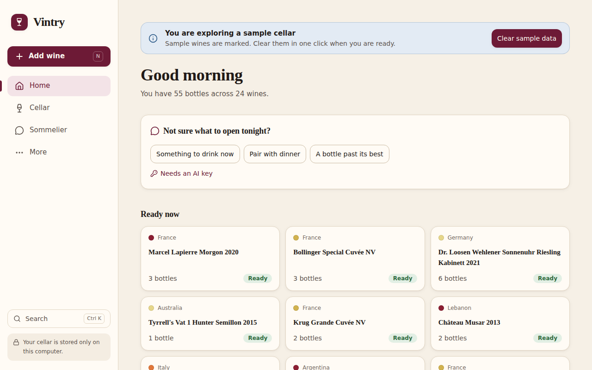
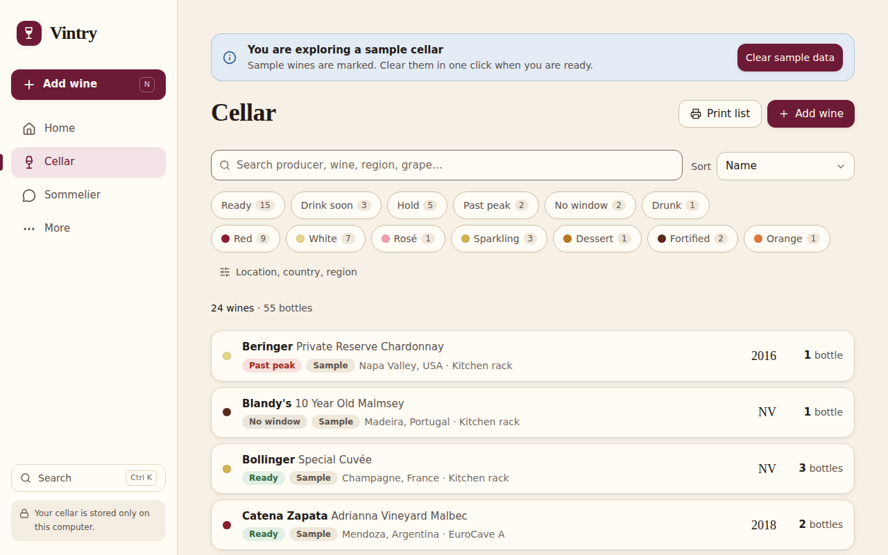
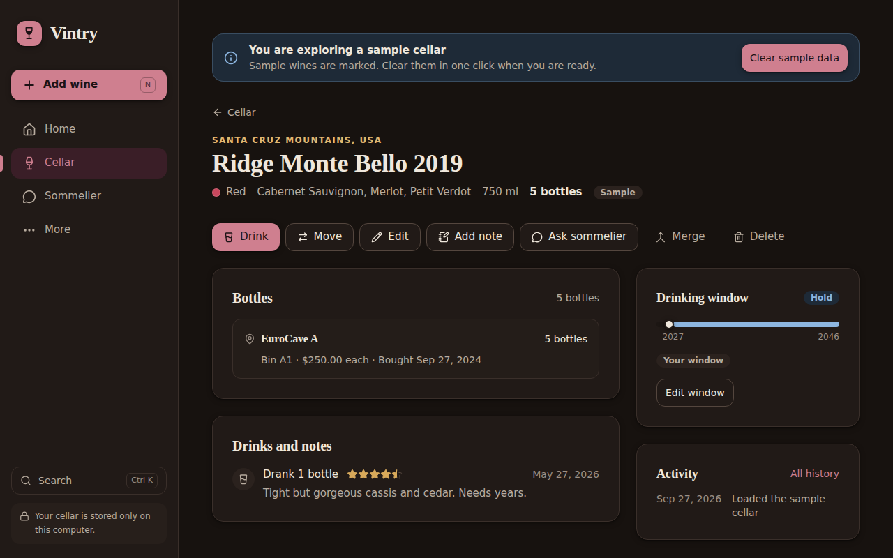
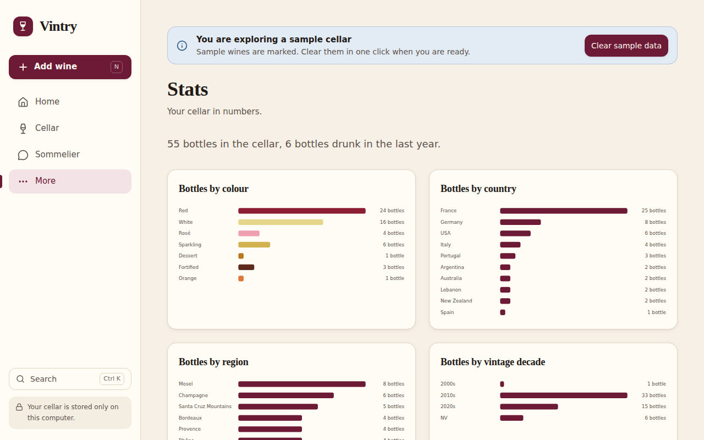

# Vintry

**Your personal wine cellar, with an AI sommelier.**

Vintry helps an independent collector keep track of every bottle, know what to drink and when, and ask an AI sommelier about their own cellar. It is free to run, private (your cellar stays on your computer), and quick to set up: no account and no server.

## Start Vintry

1. Install **Node.js** (the free LTS version) from [nodejs.org](https://nodejs.org/en/download). You do this once.
2. Download this repository (green **Code** button → **Download ZIP**) and unzip it.
3. Double-click **Start Vintry.command** (Mac) or **Start Vintry.bat** (Windows).

Vintry opens in your browser at `http://localhost:47821`. The first start takes a minute or two. The first time, your computer may warn about the file; [docs/SETUP.md](docs/SETUP.md) shows the one-time step to allow it.

You can also put Vintry at your own free web address that updates itself, install it as an app with its own icon, and add an AI key. See **[docs/SETUP.md](docs/SETUP.md)** for every step, including updating, backups, and privacy.

## What you can do

- **Add wine your way:** scan a label, type one sentence ("bought 6 bottles of 2019 Ridge Monte Bello at $250 each"), fill in a short form, or import a CSV from CellarTracker, Vivino, or a spreadsheet.
- **Know what to drink:** Home shows what is ready now, what to drink soon, what is past its peak, and what has no drinking window yet.
- **Ask the sommelier:** "What should I open with roast lamb tonight?" It answers from the bottles you actually have, and it can suggest changes that you confirm with one tap.
- **Check a price:** with an AI key, see current shop prices for a wine as a range for each currency, with a link to each shop. You choose whether to use one as your value.
- **Keep records:** drink a bottle with a rating and note, move bottles between locations and bins, keep tasting notes, a wishlist, history, and stats with a yearly recap.
- **Tidy up:** merge two records of the same wine in one step.
- **Undo anything:** every change can be undone from the toast or from History.
- **Stay safe:** automatic backups to a folder on your computer when you use the launcher, one-click backups, reminders to back up, and restore with a safety snapshot.
- **Works offline and without AI.** AI features switch on when you add your own Claude API key.

## Screenshots

These show the sample cellar that you can load on the first start.

| Home                                                                                   | Cellar                                                                               |
| -------------------------------------------------------------------------------------- | ------------------------------------------------------------------------------------ |
|                    |                         |
| **A wine (dark mode)**                                                                 | **Stats**                                                                            |
|  |  |

## For developers

Vite, React, TypeScript, Tailwind CSS, Dexie (IndexedDB), and the Anthropic TypeScript SDK. No backend.

```bash
npm install
npm run dev        # development server
npm run check      # typecheck, lint, unit tests
npm run test:e2e   # Playwright browser tests
npm run build      # production build in dist/
```

The implementation plan is in [docs/plans](docs/plans).
