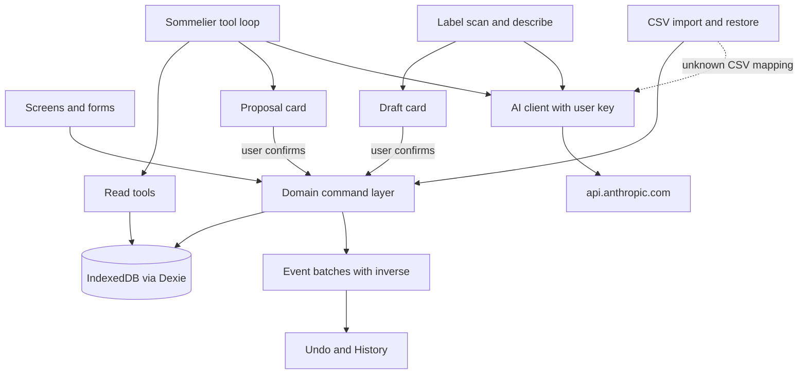
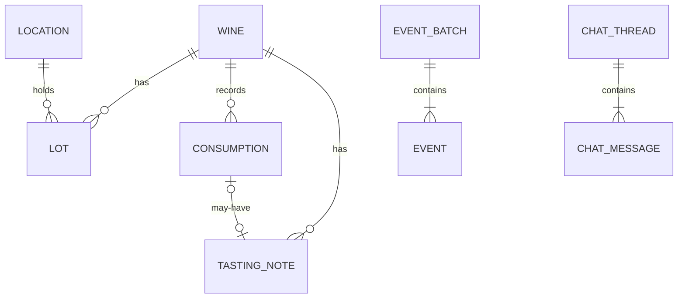
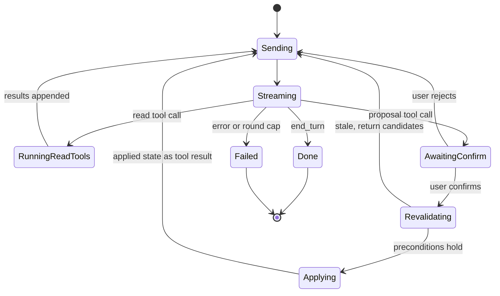
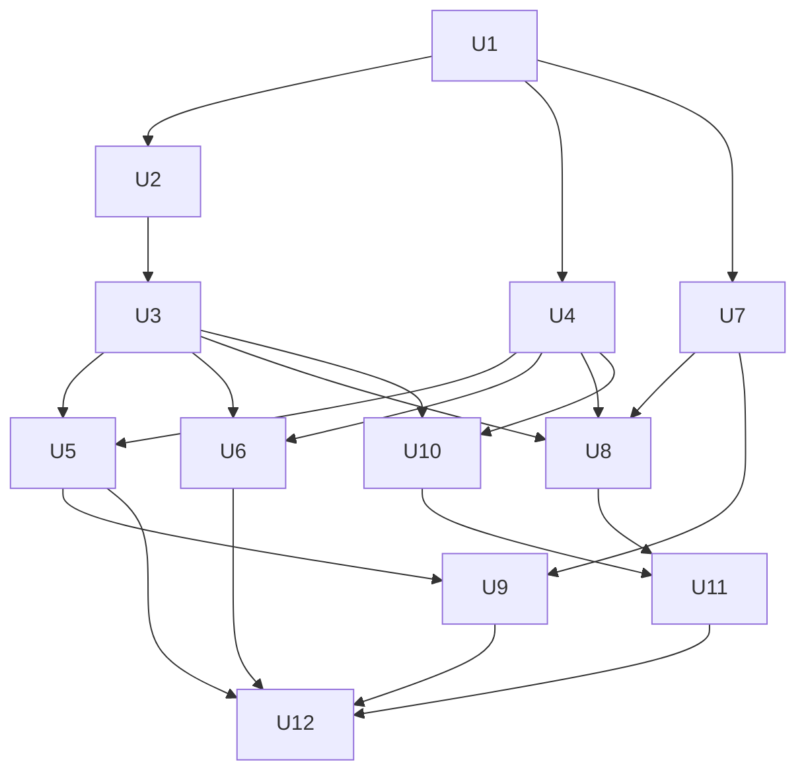

# Vintry Wine Cellar App - Plan

## Goal Capsule

- **Objective:** An independent wine collector can open Vintry in minutes, record their cellar with little typing, know what to drink and when, and ask an AI sommelier about their own bottles, while their data stays safe on their own device.
- **Means:** A local-first installable web app (PWA) with all data in the browser and AI through the collector's own Claude API key, called directly from the browser (KTD1, KTD2, KTD5).
- **Authority:** The Product Contract requirements (R-IDs) win on product behavior. KTDs win on mechanism. Units carry unit-local detail only.
- **Execution profile:** Greenfield. U1 to U4 are foundations and run first. Feature units U5 to U11 then run in parallel waves (see Sequencing). U12 closes with end-to-end journeys and docs.
- **Stop conditions:** Stop and report if the Claude API refuses direct browser calls with the `dangerouslyAllowBrowser` client option, or if IndexedDB is not available in the target browsers. Both are confirmed today (see Sources).
- **Who finishes:** An autonomous pipeline implements, reviews, and pushes. The collector decides on the merge and on where to host.

---

## Product Contract

### Summary

Vintry is a personal wine cellar app for one collector. Adding wine takes a label photo, one typed sentence, a CSV import, or a short form. Every AI result arrives as an editable draft that the user confirms. The home screen shows what is ready to drink, what is past its peak, and what is coming into its window. An AI sommelier answers questions such as "what should I open with lamb tonight?" using only bottles that are in the cellar, and it can propose changes that the user confirms with one tap. Everything works without an AI key and offline. AI features switch on when the user adds a key.

### Problem Frame

The collector has bottles spread across racks and a fridge, bought over years, each with a different best-drinking window. The incumbent tools either demand heavy data entry with a dated interface (CellarTracker) or lock AI features behind a subscription (InVintory premium at $149.99 per year, Cellared at $7.99 to $15.99 per month, Sommo at $5 per month). Two AI-first cellar apps already exist, so Vintry must win on three things: it is free to run (the user pays only their own AI usage, often cents per month), private (the cellar never leaves the device unless the user exports it), and fast to set up (open a link or double-click a launcher, no account). The main failure the collector fears is losing years of records, so data safety is a first-class feature, not polish.

### Key Decisions

- **Single collector, not a multi-user or merchant inventory system.** (session-settled: user-directed — chosen over multi-user, merchant, or restaurant inventory: the user asked for an app for an independent collector.) Governs R1, R30.
- **Ease of use and AI assistance come first.** (session-settled: user-directed — chosen over a dense power-user tool with AI as an add-on: the user said to prioritise ease of use and AI-assisted capabilities.) Governs R5, R6, R7, R14, R15, R16.
- **Setup must be easy.** (session-settled: user-directed — chosen over a self-hosted stack that needs a server, database admin, or many config steps: the user said the app should be easy to set up and use.) Governs R25, R26, R27.
- **Easy launcher and a brief tutorial are required.** The user added this during planning. Governs R26, R28, R29.
- **Windows and macOS desktops only for now.** The user narrowed the platforms during planning. Phone layouts, iOS, Android, and Linux get no specific work. Governs R26, R28.
- **AI never invents facts the user relies on for money or records.** Prices, critic scores, and market values come only from the user or an import. AI estimates (drinking windows) carry a visible "AI estimate" badge. Governs R12, R17.

### Requirements

**Cellar records**

- R1. The app stores wines and their lots for one collector: a Wine is the identity (producer, cuvée, vintage or NV, colour, country, region, appellation, grapes, bottle size), and a Lot is a quantity of that wine at one location with purchase details.
- R2. The user can add, edit, move, and drink bottles by hand, with no AI key and while offline.
- R3. Drinking a bottle records a consumption event (date, quantity, optional rating, note, occasion) and never deletes history. A wine with zero bottles stays visible under a "Drunk" filter.
- R4. Each wine shows a drinking-window status: Hold, Ready, Drink soon (window ends within 12 months), Past peak, or No window. The source of the window (user, AI, import) is visible.
- R5. The user can search, filter (colour, country, region, status, location), and sort the cellar, and find any wine in under three taps from Home.
- R6. Any change can be undone in one tap from a toast or from the History screen, when no later change touched the same records.
- R7. The user can define locations (for example "Kitchen rack", "EuroCave A") with optional bin text on each lot.
- R8. The user can keep a wishlist and turn a wishlist item into an added wine.
- R9. Home shows ready now, drink soon, past peak, recently added, bottle and wine counts, and cellar cost grouped by currency with no exchange conversion.
- R10. Stats show bottles by colour, country, region, vintage, and window status, and consumption over time.

**AI assistance (requires the user's key)**

- R11. Label scan: the user takes or uploads a label photo, and Vintry returns an editable draft wine. If the wine already exists, the draft proposes a new lot for it instead of a duplicate wine.
- R12. Describe in words: one typed sentence (for example "bought 6 bottles of 2019 Ridge Monte Bello at $250 each from K&L") becomes an editable draft. When a price basis or case size is unclear, the draft asks with a toggle instead of guessing.
- R13. Drinking-window estimate for one wine, and a bulk estimate for all wines without a window, with a cost preview before the bulk run.
- R14. Sommelier chat: answers questions about the user's own cellar and recommends only bottles that exist with quantity above zero.
- R15. The sommelier can propose add, drink, move, edit, and quantity changes. Nothing changes until the user confirms a card. Proposals left from an earlier session expire.
- R16. Tasting-note helper: turns rough notes into a tidy note that the user edits and saves.
- R17. Every AI result shows as a draft or a clearly marked estimate. AI never fills price, critic score, or market value.
- R18. Every AI entry point has three states: ready, no key (explains how to add one and offers the manual path), and unavailable (offline or an error, with a plain-language reason).
- R19. Settings show AI usage (tokens and estimated cost) per feature and in total, and let the user choose the model.

**Import, export, and data safety**

- R20. CSV import supports CellarTracker and Vivino exports with built-in column mappings that need no AI, plus generic CSV files with an AI-suggested mapping that the user can correct. Import shows a preview before it writes anything.
- R21. The user can export a full JSON backup and a CSV of the cellar, and restore a JSON backup. Restore replaces all data after an automatic safety snapshot.
- R22. The app reminds the user to back up after 20 changes or 14 days since the last backup, whichever comes first.
- R23. The app asks the browser to keep its data (persistent storage) after the first real write.
- R24. A sample cellar can be loaded to explore, is clearly marked, and can be cleared in one action.

**Setup, launch, and learning**

- R25. The app runs with no account, no server, and no configuration. The AI key is optional and can be added at any time.
- R26. A non-technical user can start the app by double-clicking a launcher file on macOS or Windows, or by opening a hosted link, and can install it as an app icon in the Dock or taskbar. Windows and macOS desktops are the only target platforms for now.
- R27. A setup guide explains hosting the app for free from a private repo (Cloudflare Pages or Netlify) in a few clicks, and how to get a Claude API key.
- R28. First launch runs a short onboarding: welcome, optional AI key with a test button and cost note, and a choice of how to start (scan, describe, add by hand, import, or sample cellar). In Safari on macOS, onboarding asks the user to add the app to the Dock first (or use Chrome or Edge), because Safari can evict data of sites that are not used for 7 days and keeps Dock-app data apart from tab data.
- R29. A brief guided tour (four to six steps) points out the main screens after onboarding, and a Help page ("How to use Vintry") can be opened at any time from More.

**Updates**

- R30. When a new version is deployed, the app shows "New version available" with a Reload button, and a What's New page lists changes by version.
- R31. Data upgrades between app versions run automatically and never lose data. An open second tab that blocks an upgrade is asked to reload.

### Acceptance Examples

- AE1. Covers R11. Given the cellar holds "Ridge Monte Bello 2019, 750ml", when the user scans a label the model reads as the same wine, then the draft card says "Add bottles to existing wine" and saving creates a lot, not a second wine.
- AE2. Covers R12. Given the sentence "a case of 2016 Barolo for £600", when the draft opens, then quantity shows 12 with a note "case assumed 12", and price shows a toggle "£600 total / per bottle" set to total, giving £50 per bottle.
- AE3. Covers R14. Given two lots of Monte Bello (2016 and 2019), when the user says "I drank the Monte Bello", then the sommelier asks which vintage and makes no proposal.
- AE4. Covers R6. Given the user moved 2 bottles and then drank 1 of the same lot, when they undo the move, then undo is refused with "A later change touched this lot (Drank 1 bottle). Undo that first."
- AE5. Covers R18. Given no key is set, when the user opens Scan label, then the screen explains that scanning needs an AI key, links to Settings, and offers "Add by hand" with the form open.
- AE6. Covers R21. Given a cellar with 40 wines, when the user restores a backup, then a safety snapshot is stored first and the "Undo restore" action brings the 40 wines back.

### Success Criteria

- A new user with the sample cellar reaches a wine detail screen within 60 seconds of first launch.
- A typed-sentence add takes one sentence plus one confirm tap.
- A 300-row CellarTracker CSV imports in under 5 seconds without an AI key.
- The app scores no Lighthouse accessibility issue above "minor" on Home, Cellar, and Wine detail.

### Scope Boundaries

**Deferred for later**

- Sync between devices. V1 moves data between devices with a backup file. A later option is a sync file in the user's own cloud drive or a managed service such as Dexie Cloud.
- Merge restore. V1 restore replaces. Every entity has a UUID and `updatedAt` from schema version 1 so merge needs no data migration later.
- Market valuation from web sources, critic score lookup, and web-grounded window lookups.
- Voice input beyond the browser's built-in speech-to-text on the describe field.
- Visual 3D or rack-map cellar view.
- Taste-preference memory for the sommelier, proactive notifications, and an MCP server for desktop Claude.

**Outside this product's identity**

- Multi-user accounts, sharing, social feeds, and community ratings.
- Merchant, restaurant, or trade inventory, invoicing, or point of sale.
- Buying wine inside the app.

---

## Planning Contract

### Key Technical Decisions

- KTD1. **Local-first PWA, no backend.** Vite, React, and TypeScript build a static site. All data lives in IndexedDB through Dexie. This removes accounts, servers, and hosting cost, which serves R25 and R26. Rejected: a hosted database (setup and privacy cost) and a native app (store review and build tooling the user cannot run).
- KTD2. **Bring your own Claude API key, called from the browser.** The official `@anthropic-ai/sdk` client runs with `dangerouslyAllowBrowser: true`, which sends the `anthropic-dangerous-direct-browser-access` header that Anthropic's API accepts for CORS. The key is stored only in the browser (IndexedDB settings table) and never leaves it except to `api.anthropic.com`. A strict Content-Security-Policy with no third-party scripts limits the XSS risk. The risk is accepted for a single-user tool and is written in the setup guide.
- KTD3. **Default model `claude-opus-5`, user-selectable.** Settings offer "Best (Claude Opus 5)", "Balanced (Claude Sonnet 5)", and "Economy (Claude Haiku 4.5)". Opus 5 requests use adaptive thinking with `output_config.effort` set per feature (low for extraction and mapping, medium for chat) and the server-side refusal fallback (`fallbacks: "default"` with the `server-side-fallback-2026-07-01` beta). Haiku 4.5 requests omit adaptive thinking and effort. Model IDs and prices live in one table in `src/ai/models.ts`. Implementers must load the `claude-api` skill and follow its TypeScript docs; the SDK surface is not to be guessed.
- KTD4. **One domain command layer for every write.** All changes, from UI forms, quick-add, scan, import, restore, and chat, go through commands in `src/domain/commands/`. Each command validates input with a zod schema, runs in one Dexie transaction, writes an event batch with a source (`user`, `ai-chat`, `ai-scan`, `ai-describe`, `import`, `restore`, `sample`), and returns its inverse plus the preconditions for undo. The same zod schemas generate the sommelier's tool JSON schemas.
- KTD5. **Lots, not single bottles.** A Lot is a quantity of one wine at one location. Partial moves split a lot (the new lot records `splitFromLotId`). A lot at zero is closed, not deleted. Bottle size lives on the Wine, so a magnum is a different wine for matching.
- KTD6. **Duplicate matching key.** Normalized producer + cuvée + vintage (or NV) + bottle size. Normalization lowercases, strips accents and punctuation, and collapses spaces. Scan, describe, and import use the same matcher in `src/domain/match.ts`.
- KTD7. **Undo by precondition.** An event batch stores the inverse operations and a snapshot of each touched record's `updatedAt`. Undo runs only if every touched record still has that `updatedAt`. Otherwise it names the later batch in the way (R6, AE4).
- KTD8. **Soft delete.** Deleting a wine sets `deletedAt` and hides it everywhere. Undo clears it. A "Recently deleted" list in History allows restore for 30 days. Purge after 30 days happens on app start.
- KTD9. **One tasting-note entity.** A TastingNote has an optional `consumptionId`. Notes typed while drinking a bottle and notes added later are the same record type.
- KTD10. **Structured extraction is not chat.** Label scan, describe, window estimates, note tidy-up, and CSV mapping each use one structured-output request (`output_config.format` with a JSON schema generated from zod) that fills a draft. Only the sommelier uses a tool loop.
- KTD11. **The sommelier tool loop runs in the browser and pauses for proposals.** Read tools (`search_cellar`, `get_wine`, `list_locations`, `cellar_stats`, `get_consumption_history`, `show_bottles`) run at once. Proposal tools (`propose_add_bottles`, `propose_consume`, `propose_move`, `propose_update_wine`, `propose_adjust_quantity`, `propose_set_drinking_window`) render a confirm card and the loop waits. Write tools accept IDs from earlier reads plus an `expected_quantity` precondition. A mismatch or an ambiguous reference returns candidates and no change. The loop is capped at 8 tool rounds per user turn. API key, wipe, restore, export, and hard delete are human-only; a parity test enforces that each command is either exposed as a tool or marked human-only with a reason.
- KTD12. **Sommelier context.** A static system prompt (role, vocabulary, confirmation rules, "recommend only bottles returned by tools", locale, currency) gets a cache breakpoint. A cellar snapshot follows: date, totals, locations, status counts, and the full compact lot table only when the cellar has 200 lots or fewer. The current screen (wine or filter in view) follows last. Chat threads persist in IndexedDB. Each new user turn re-reads state through tools rather than trusting old tool results.
- KTD13. **CSV import is deterministic first.** Presets map CellarTracker and Vivino headers with no AI. Decoding tries UTF-8 strictly, then falls back to windows-1252. The parser detects comma or semicolon delimiters and decimal commas. CellarTracker's `9999` window sentinel and `1001` NV vintage map to empty and NV. For unknown CSVs the AI returns only a column mapping from the headers plus 20 sample rows. Code applies the mapping to every row. Parsing uses `papaparse`.
- KTD14. **Images are downscaled before upload.** The label photo is decoded with `createImageBitmap` (respecting EXIF orientation), scaled so the long edge is at most 1568 px, and re-encoded as JPEG quality 0.85. A 256 px thumbnail is stored with the wine. HEIC files that the browser cannot decode show a message to use JPEG or the camera button.
- KTD15. **Backup format.** JSON `{ app: "vintry", schemaVersion, exportedAt, data: { table: rows[] } }` with zod validation on import. Photos are included as data URLs. Backups from older schema versions pass through the same migration functions as the database. Restore takes a safety snapshot (a full backup stored in a `snapshots` table, last 3 kept) before replacing. On Chromium browsers the user can pick a backup file once and later backups overwrite it through the File System Access API; other browsers download a file.
- KTD16. **Updates.** `vite-plugin-pwa` with `registerType: "prompt"` shows a "New version available" toast with Reload. Dexie `version(n).upgrade()` functions carry data forward; a `versionchange` handler closes the database and shows "Vintry was updated in another tab, reload". The changelog lives in `src/content/changelog.ts` and feeds What's New.
- KTD17. **Hosting and launcher.** The build output is a static folder. `_headers` and `_redirects` serve Cloudflare Pages and Netlify; `vercel.json` serves Vercel. GitHub Pages is not used because it needs a paid plan for a private repo. Two launchers (`Start Vintry.command` for macOS, `Start Vintry.bat` for Windows) check for Node 20 or newer, install dependencies on first run, build when the build is missing or older than the source, start the preview server on a fixed port (4173), and open the browser. If Node is missing, the launcher says so in plain words and opens nodejs.org.
- KTD18. **UI stack.** Tailwind CSS v4 with design tokens as CSS variables, light and dark themes, lucide-react icons, and no component library. Desktop-first layout with a left sidebar (Home, Cellar, Add, Sommelier, More groups) that collapses to an icon rail below 1100 px and to a bottom bar below 720 px, so a narrow window still works. Keyboard shortcuts: `/` focuses search, `N` opens Add. Click targets are at least 40 px. TypeScript is pinned to `~5.9` because TypeScript 7 breaks typescript-eslint today. No Recharts (open blank-chart bug with React 19.2). Charts are hand-built SVG bar charts to keep the bundle small.
- KTD19. **Testing.** Vitest with jsdom and fake-indexeddb for domain, database, AI (with a scripted fake model), and component tests. Playwright for end-to-end journeys on desktop Chromium at a wide and a narrow (1024 × 700) window. No test calls the real API. A small live eval script (`scripts/ai-eval.ts`) runs only when `ANTHROPIC_API_KEY` is set and is not part of CI.

### High-Level Technical Design

Component shape. Every write path meets at the command layer, and the AI never writes directly.



Data model.



Entity fields (directional): every entity has `id` (UUID), `createdAt`, `updatedAt`. Wine adds `deletedAt`, `isSample`, `windowFrom`, `windowTo`, `windowSource` (`user` | `ai` | `import`), `windowNote`, `thumbnail`, `rating`, `tags`, `notes`. Lot adds `wineId`, `locationId`, `bin`, `quantity`, `closedAt`, `splitFromLotId`, `purchaseDate`, `pricePerBottle`, `currency`, `store`, `isSample`. Other tables: `consumptions`, `tastingNotes`, `locations`, `wishlist`, `eventBatches`, `chatThreads`, `chatMessages`, `settings` (key-value), `aiUsage`, `snapshots`.

Sommelier turn lifecycle.



Drinking-window status (R4), evaluated with the current year Y: no `windowFrom` and no `windowTo` gives No window; Y < `windowFrom` gives Hold; Y > `windowTo` gives Past peak; `windowTo` − Y ≤ 1 gives Drink soon; otherwise Ready.

### Output Structure

```text
Start Vintry.command, Start Vintry.bat
public/                 icons, manifest assets, _headers, _redirects
src/
  app/                  router, layout, providers, update prompt, error boundary
  components/ui/        Button, Card, Sheet, Field, Toast, EmptyState, WindowBar, Badge
  db/                   schema, migrations, backup format, sample cellar
  domain/               types, commands, events and undo, selectors, match, money
  ai/                   client, models, errors, usage, features (scan, describe, window, note, csv), sommelier
  features/             home, cellar, wine, add, sommelier, history, wishlist, stats, locations, settings, backup, import, onboarding, tour, help, whats-new
  content/              changelog, help text
  lib/                  csv, image, format, id, platform
e2e/                    Playwright journeys and fixtures
docs/                   SETUP.md, plans
scripts/                ai-eval.ts, icon generation
```

### Assumptions

- The collector uses a Windows or Mac computer with Chrome, Edge, or Safari. Label photos come from a phone photo moved to the computer, a webcam, or drag and drop.
- Default currency comes from the browser locale (for example GBP for en-GB) and can be changed in Settings.
- Most first-time users will not have an API key, so the manual form, CSV presets, and the sample cellar carry the no-AI experience.
- The hosted build and the local launcher build are separate origins, so their data is separate. The setup guide says so and points to backup and restore for moving data.

### Sequencing



Wave A: U1, then U2 with U3, U4, and U7 in parallel. Wave B: U5, U6, U8, U10 in parallel. Wave C: U9 and U11 in parallel. Wave D: U12. U4 registers every route with a stub page up front, so feature units only write inside their own `src/features/<name>/` folder and do not edit shared routing.

### Risks

| Risk | Mitigation |
|---|---|
| Browser storage eviction (Safari evicts script-written storage for sites not used in 7 days unless added to the Dock) | Persistent storage request (R23), install-first in Safari (R28), backup reminders (R22), file-handle backups on Chromium (KTD15) |
| API key exposure through XSS | Strict CSP in `_headers` and `vercel.json`, no third-party scripts, no `dangerouslySetInnerHTML`, key removable in Settings (KTD2) |
| Prompt injection from label text, CSV cells, or notes | All AI writes pass a confirm card (R15), imported text is fenced as data in prompts, AI cannot reach human-only commands (KTD11) |
| AI misreads prices or scores | AI never fills price, score, or value (R17). Draft fields are editable. Number fields are validated as numbers |
| Schema mistakes after release | Migration fixture tests from each schema version and each backup version (U2) |
| CellarTracker CSV lacks per-bottle cost, store, and bin | Import maps what exists and lets the user set a default location during preview (U10) |

### Sources

- Anthropic browser access: `anthropic-dangerous-direct-browser-access` header (https://simonwillison.net/2024/Aug/23/anthropic-dangerous-direct-browser-access/) and the TypeScript SDK README (https://github.com/anthropics/anthropic-sdk-typescript).
- Competitors and pricing: InVintory (https://invintory.com/blog/wine-inventory-app-pricing-free-vs-premium-vs-elite/), Cellared (https://cellared.ai/pricing), Sommo (https://sommo.app/pricing/), CellarTracker (https://support.cellartracker.com/article/80-cellartracker-subscription).
- CellarTracker export columns and gaps: https://cellariq.ai/cellartracker-export and https://support.cellartracker.com/article/29-exporting-data.
- AI valuation failure case: https://salvatoretirabassi.substack.com/p/confident-and-wrong-what-a-wine-auction.
- Hosting: GitHub Pages private-repo limit (https://github.com/orgs/community/discussions/167331); static host comparison (https://guptadeepak.com/tools/top-5-static-site-hosting-jamstack-platforms-2026/).
- Local-first storage risk: https://blog.openreplay.com/local-first-pwa-architecture/ and WebKit storage policy (https://webkit.org/blog/14403/updates-to-storage-policy/).

---

## Implementation Units

| U-ID | Title | Key files | Depends on |
|---|---|---|---|
| U1 | Project scaffold, launcher, deploy config | `package.json`, `vite.config.ts`, `public/_headers`, `Start Vintry.command` | none |
| U2 | Data model, database, migrations, backup format | `src/db/` | U1 |
| U3 | Command layer, events, undo, selectors | `src/domain/` | U2 |
| U4 | App shell, design system, routing, PWA update | `src/app/`, `src/components/ui/` | U1 |
| U5 | Cellar, wine detail, manual add and edit, drink, move, locations | `src/features/cellar/`, `wine/`, `add/`, `locations/` | U3, U4 |
| U6 | Home, History, Wishlist, Stats | `src/features/home/`, `history/`, `wishlist/`, `stats/` | U3, U4 |
| U7 | AI foundation and Settings | `src/ai/`, `src/features/settings/` | U1 |
| U8 | AI add flows, windows, note helper | `src/ai/features/`, `src/features/add/` | U3, U4, U7 |
| U9 | Sommelier chat | `src/ai/sommelier/`, `src/features/sommelier/` | U5, U7 |
| U10 | Import, export, backup, restore | `src/lib/csv.ts`, `src/features/import/`, `src/features/backup/` | U3, U4 |
| U11 | Onboarding, tour, Help, sample cellar, What's New | `src/features/onboarding/`, `tour/`, `help/`, `whats-new/` | U8, U10 |
| U12 | End-to-end journeys, parity test, setup docs | `e2e/`, `README.md`, `docs/SETUP.md` | U5, U6, U9, U11 |

### U1. Project scaffold, launcher, deploy config

- **Goal:** A buildable, testable, deployable empty app with one-click local launch.
- **Requirements:** R25, R26, R27 (config part), KTD1, KTD17, KTD19.
- **Dependencies:** none.
- **Files:** `package.json`, `vite.config.ts`, `tsconfig*.json`, `eslint.config.js`, `.prettierrc`, `vitest.config.ts` or Vitest settings in `vite.config.ts`, `playwright.config.ts`, `src/main.tsx`, `src/App.tsx`, `src/App.test.tsx`, `e2e/smoke.spec.ts`, `src/styles/index.css`, `public/icon.svg`, `public/*.png`, `public/_headers`, `public/_redirects`, `vercel.json`, `netlify.toml`, `.github/workflows/ci.yml`, `Start Vintry.command`, `Start Vintry.bat`.
- **Approach:**
  1. Vite React TypeScript with strict mode, Tailwind v4 via its Vite plugin, and `vite-plugin-pwa` with `registerType: "prompt"`, manifest, icons, and a Workbox rule that never caches `api.anthropic.com`.
  2. CSP and security headers in `_headers` and `vercel.json` per KTD2, with `connect-src 'self' https://api.anthropic.com`.
  3. Launchers per KTD17. The macOS `.command` is a bash script marked executable. The Windows `.bat` uses equivalent steps. Each prints friendly progress lines and keeps the window open on failure.
  4. CI runs typecheck, lint, unit tests, build, and Playwright.
- **Test scenarios:**
  - `App.test.tsx`: rendering the app shows the "Vintry" heading.
  - `e2e/smoke.spec.ts`: the built preview serves `/` and shows "Vintry"; a deep link such as `/cellar` also loads (SPA fallback).
  - Launcher: running `Start Vintry.command` with bash in a clean checkout installs, builds, and serves on port 4173 (smoke check in CI on Linux runs the same script with the browser-open step skipped through an env flag).
- **Verification:** `npm run check`, `npm run build`, and `npm run test:e2e` pass locally.

### U2. Data model, database, migrations, backup format

- **Goal:** Typed entities, the Dexie database, and a versioned backup format with migration tests.
- **Requirements:** R1, R3, R21, R24, R31, KTD5, KTD8, KTD9, KTD15, KTD16.
- **Dependencies:** U1.
- **Files:** `src/domain/types.ts`, `src/db/db.ts`, `src/db/migrations.ts`, `src/db/backup.ts`, `src/db/sample-cellar.ts`, `src/lib/id.ts`, `src/db/db.test.ts`, `src/db/backup.test.ts`, `src/db/migrations.test.ts`.
- **Approach:**
  1. Zod schemas in `src/domain/types.ts` are the single source for entity types, following the Entity fields list in High-Level Technical Design.
  2. Dexie schema version 1 with indexes for the queries the screens need: wines by producer, vintage, colour, country, region, `deletedAt`; lots by `wineId`, `locationId`, `closedAt`; consumptions by `date` and `wineId`; event batches by `createdAt`.
  3. A `versionchange` handler closes the database and raises an app-level event that U4 shows as a reload prompt.
  4. `backup.ts` exports and validates the format in KTD15, including a migration path for older `schemaVersion` values.
  5. `sample-cellar.ts` holds about 24 realistic wines across colours, regions, windows, and two locations, all with `isSample: true`.
- **Patterns to follow:** Dexie `version().stores().upgrade()`; zod `safeParse` at every trust boundary (backup import, AI output, CSV rows).
- **Test scenarios:**
  - Creating a wine and lot and reading them back returns equal objects with UUIDs and timestamps.
  - A backup export followed by import into an empty database reproduces every table row for row.
  - Importing a backup with a missing required field fails with a readable message naming the table and field, and writes nothing.
  - Importing a backup with `app` not equal to "vintry" fails with "This is not a Vintry backup".
  - A backup from a future `schemaVersion` fails with "This backup was made by a newer Vintry. Update the app first."
  - Migration fixture: a database seeded at version 1 opens under the current version with all rows intact (the fixture pattern repeats for every future version).
  - Loading the sample cellar marks every created row `isSample`, and clearing it removes only those rows.
- **Verification:** Database and backup tests pass under fake-indexeddb.

### U3. Command layer, events, undo, selectors

- **Goal:** Every data change goes through validated, undoable commands, and screens read through tested selectors.
- **Requirements:** R2, R3, R4, R6, R9, KTD4, KTD5, KTD6, KTD7, KTD8.
- **Dependencies:** U2.
- **Files:** `src/domain/commands/*.ts` (addWine, addLot, addBottles, updateWine, deleteWine, restoreWine, consumeBottles, moveBottles, adjustQuantity, setDrinkingWindow, addTastingNote, updateTastingNote, locations CRUD, wishlist CRUD, convertWishlistItem, loadSampleCellar, clearSampleCellar), `src/domain/commands/registry.ts`, `src/domain/events.ts`, `src/domain/undo.ts`, `src/domain/selectors.ts`, `src/domain/window.ts`, `src/domain/match.ts`, `src/domain/money.ts`, tests beside each.
- **Approach:**
  1. Each command: zod input schema, a `humanOnly` flag with reason where it applies, one Dexie transaction, one event batch with source and inverse, and a result with the IDs it touched.
  2. `registry.ts` lists every command with its schema and flags. U9 builds tools from it, and the parity test reads it.
  3. `moveBottles` splits a lot for partial moves. `consumeBottles` closes a lot at zero and writes a consumption and an optional tasting note.
  4. Selectors: cellar list with filters and sort, wine detail, status counts, home sections, cost grouped by currency, stats series, recently deleted.
  5. Window status per the rule in High-Level Technical Design; the current year is injectable for tests.
- **Execution note:** Implement the command layer and undo test-first; later units depend on its contracts.
- **Test scenarios:**
  - `addBottles` for a new wine creates one wine and one lot and one event batch with source `user`.
  - `addBottles` whose wine matches an existing one (KTD6) adds a lot to the existing wine.
  - Matching treats "Château Margaux" and "chateau margaux" as the same, and a magnum as different from a 750 ml bottle.
  - `consumeBottles` of 2 from a lot of 3 leaves 1 and records one consumption with the date and rating.
  - `consumeBottles` of the last bottle closes the lot, and the wine appears under the Drunk filter.
  - `consumeBottles` of more than the lot holds fails and changes nothing.
  - `moveBottles` of 2 from a lot of 6 creates a new lot of 2 at the target with `splitFromLotId` and leaves 4.
  - Undo of a move restores one lot of 6 and removes the split lot.
  - Covers AE4. Undo of a move after a later consume on the same lot is refused and names the blocking batch.
  - `deleteWine` sets `deletedAt`, hides the wine from selectors, and undo restores it; purge removes soft-deleted wines older than 30 days.
  - `setDrinkingWindow` with source `ai` on an empty window applies; with a user-set window it requires the `overwrite` flag.
  - Window status: for year 2026, window 2028 to 2035 gives Hold, 2020 to 2027 gives Drink soon, 2020 to 2024 gives Past peak, 2022 to 2030 gives Ready, none gives No window.
  - Cost grouped by currency returns separate GBP and USD totals and never sums across currencies.
  - Registry: every command has a schema, and every `humanOnly` command has a reason.
- **Verification:** All domain tests pass; no component writes to Dexie outside the command layer (lint rule or grep check in CI).

### U4. App shell, design system, routing, PWA update

- **Goal:** A polished, accessible shell that every feature plugs into.
- **Requirements:** R5 (navigation), R23, R30, R31, KTD16, KTD18.
- **Dependencies:** U1. It uses U2's `versionchange` event once U2 lands; until then it exposes the handler hook.
- **Files:** `src/app/router.tsx`, `src/app/Layout.tsx`, `src/app/BottomNav.tsx`, `src/app/UpdatePrompt.tsx`, `src/app/ErrorBoundary.tsx`, `src/app/providers.tsx`, `src/app/theme.ts`, `src/app/storage.ts`, `src/components/ui/*.tsx`, `src/features/*/index.tsx` stubs for every route, tests beside each.
- **Approach:**
  1. Routes: `/` Home, `/cellar`, `/wine/:id`, `/add` (hub), `/add/scan`, `/add/describe`, `/add/manual`, `/import`, `/sommelier`, `/sommelier/:threadId`, `/more`, `/history`, `/wishlist`, `/stats`, `/locations`, `/settings`, `/backup`, `/help`, `/whats-new`, `/welcome`. Each route loads a stub page from its feature folder so feature units never edit the router.
  2. UI primitives: Button (variants, loading), Card, Sheet (side panel on wide windows, dialog on narrow ones, focus trap), Field (label, hint, error), Select, Stepper, Toast with an action button (used for Undo), Badge, EmptyState, WindowBar (a horizontal bar marking the window and the current year), Skeleton.
  3. Theme: system, light, or dark, stored in settings, applied as a class on `html`.
  4. `storage.ts` wraps `navigator.storage.persist()` and `estimate()`; the call happens after the first real write (R23).
  5. Update prompt uses the `vite-plugin-pwa` register hook per KTD16.
- **Test scenarios:**
  - The sidebar shows five items with accessible names and marks the current route with `aria-current`; below 720 px the same items render as a bottom bar.
  - Sheet traps focus, closes on Escape, and returns focus to the trigger.
  - Toast with an Undo action calls its handler once and closes.
  - Theme set to dark adds the `dark` class; system theme follows `prefers-color-scheme`.
  - The `versionchange` signal shows the reload banner.
  - Every route renders its stub without error (router smoke test).
- **Verification:** Shell tests pass; Playwright smoke navigates all five sections at the wide and narrow window sizes.

### U5. Cellar, wine detail, manual add and edit, drink, move, locations

- **Goal:** The complete no-AI cellar experience.
- **Requirements:** R1, R2, R3, R4, R5, R6, R7, R17 (manual path), KTD5, KTD8, KTD9.
- **Dependencies:** U3, U4.
- **Files:** `src/features/cellar/`, `src/features/wine/`, `src/features/add/ManualForm.tsx`, `src/features/add/DraftCard.tsx`, `src/features/locations/`, tests beside each.
- **Approach:**
  1. Cellar list: search box (producer, wine, region, grape), filter chips (colour, status, location, country), sort (name, vintage, window, recently added), and a Drunk filter. Rows show a colour dot, producer, cuvée, vintage, bottle count, and status badge. A virtualized list is not needed below 2,000 rows; render plainly.
  2. Wine detail: header, WindowBar with source badge, lots grouped by location, actions Drink, Move, Edit, Add note, Ask sommelier (links to U9 with context), Delete. Consumption and note history below.
  3. `DraftCard` is the single editable confirm card for new bottles, shared by manual add, scan, describe, wishlist conversion, and sommelier proposals. It shows the "Add to existing wine" state from the matcher.
  4. Drink sheet: quantity stepper, date (default today), rating (1 to 5 stars in half steps or a 100-point toggle stored as 100-point), note, occasion. Move sheet: quantity and destination, with inline "New location".
  5. Every action shows an Undo toast.
- **Test scenarios:**
  - Manual add with producer, name, vintage, quantity 3, and location creates the wine and shows it in the list with 3 bottles.
  - Manual add of an existing wine shows "Add to existing wine" and adds a lot.
  - Required-field validation: saving with an empty producer shows "Producer is required" and saves nothing.
  - Searching "barolo" filters to matching wines; clearing restores the full list.
  - Filter "Ready" shows only Ready and Drink soon wines.
  - Drinking the last bottle moves the wine to the Drunk filter and shows it in History.
  - Moving 2 of 6 bottles to a new location shows two lot rows on the detail screen.
  - Tapping Undo on the move toast restores one lot of 6.
  - Deleting a wine hides it and shows an Undo toast; undo brings it back.
  - Deleting a location that holds lots is refused with a message naming the lot count.
- **Verification:** Component tests pass; a Playwright journey adds, drinks, moves, and undoes.

### U6. Home, History, Wishlist, Stats

- **Goal:** The daily-use screens that answer "what should I drink and what do I have".
- **Requirements:** R6, R8, R9, R10, R22 (reminder banner slot).
- **Dependencies:** U3, U4.
- **Files:** `src/features/home/`, `src/features/history/`, `src/features/wishlist/`, `src/features/stats/`, `src/components/ui/BarChart.tsx`, tests beside each.
- **Approach:**
  1. Home: greeting with counts, sections Ready now, Drink soon, Past peak, Coming into window this year, Recently added, and cost by currency. Empty states link to Add and to the sample cellar. A banner slot hosts the backup reminder (U10) and the sample-data banner (U11).
  2. History: a timeline of event batches with plain-language summaries ("Drank 1 × Ridge Monte Bello 2019"), per-item Undo per KTD7, a Consumption log filter, and Recently deleted with Restore.
  3. Wishlist: add by hand (producer, wine, vintage, note, target price), mark bought converts through `DraftCard`.
  4. Stats: SVG bar charts for bottles by colour, country, vintage decade, and window status, and bottles drunk per month for the last 12 months. Each chart has a table fallback for screen readers.
- **Test scenarios:**
  - With sample data for year 2026, Home lists each wine under the section its window status gives.
  - An empty cellar shows the empty state with "Add your first wine" and "Explore a sample cellar".
  - History shows the newest batch first and its Undo reverses it.
  - Undo on a blocked batch shows the blocking batch's summary.
  - Converting a wishlist item opens a draft with its fields and removes the item after save.
  - Stats bars for colour sum to the total bottle count.
- **Verification:** Tests pass; Home renders under 200 ms for 500 wines in a jsdom timing check or a Playwright trace.

### U7. AI foundation and Settings

- **Goal:** A safe, observable AI client that every AI feature shares, and the Settings screen.
- **Requirements:** R18, R19, R25, KTD2, KTD3.
- **Dependencies:** U1.
- **Files:** `src/ai/client.ts`, `src/ai/models.ts`, `src/ai/errors.ts`, `src/ai/usage.ts`, `src/ai/structured.ts`, `src/ai/fake.ts`, `src/ai/useAiStatus.ts`, `src/features/settings/`, tests beside each.
- **Approach:**
  1. `client.ts` builds the SDK client from the stored key with `dangerouslyAllowBrowser: true`; no module imports the key directly.
  2. `models.ts` holds the model table (ID, label, input and output price per million tokens, whether adaptive thinking and effort apply). Default `claude-opus-5`.
  3. `structured.ts` sends one request with `output_config.format` built from a zod schema, validates the result with zod, checks `stop_reason` (including `refusal` and `max_tokens`) before reading content, and records usage.
  4. `errors.ts` maps SDK error classes and conditions to plain messages: invalid key (401), no credit or billing (400 with billing message or 402-style error), rate limit (429), overloaded (529), network or offline, stream dropped, model not found (404), refusal.
  5. `usage.ts` stores per-request tokens and cost by feature and model in `aiUsage`.
  6. `useAiStatus` returns ready, no key, or unavailable (offline or last error) for R18.
  7. Settings: key field (masked, paste, Test key button that sends a tiny request), Remove key, model choice with price hints, usage totals this month and all time, currency, theme, and links to Backup, What's New, Help.
  8. `fake.ts` is a scripted fake with the same interface for tests.
- **Test scenarios:**
  - With no key, `useAiStatus` returns no key and every AI entry point shows the no-key state.
  - Test key with a fake 401 shows "That key was not accepted. Check it was copied fully."
  - A fake 429 maps to "Too many requests, try again in a minute"; offline maps to "You are offline".
  - A structured call whose output fails zod validation raises a typed error and records usage.
  - A `refusal` stop reason is surfaced as a plain message and does not parse content.
  - Usage for 1,000 input and 500 output tokens on Opus 5 is recorded as $0.0175.
  - The key never appears in any exported backup.
- **Verification:** Tests pass with the fake client; a manual live check with a real key is listed in `scripts/ai-eval.ts`.

### U8. AI add flows, windows, note helper

- **Goal:** Scan, describe, drinking-window estimates, and note tidy-up, each ending in an editable draft or marked estimate.
- **Requirements:** R11, R12, R13, R16, R17, R18, KTD6, KTD10, KTD14.
- **Dependencies:** U3, U4, U7 (and U5's `DraftCard`; if U5 is still in flight, build against its props contract and integrate at the end of the wave).
- **Files:** `src/ai/features/scanLabel.ts`, `src/ai/features/describe.ts`, `src/ai/features/estimateWindow.ts`, `src/ai/features/tidyNote.ts`, `src/lib/image.ts`, `src/features/add/ScanPage.tsx`, `src/features/add/DescribePage.tsx`, `src/features/add/AddHub.tsx`, `src/features/wine/EstimateWindowButton.tsx`, `src/features/wine/BulkEstimate.tsx`, tests beside each.
- **Approach:**
  1. Add hub: four large tiles (Scan label, Describe, Add by hand, Import CSV) with the AI tiles showing their no-key state.
  2. Scan: drop zone plus Choose photo, and a webcam capture button when `getUserMedia` is available; downscale per KTD14, one structured request returning wine fields plus a per-field confidence (high or low); low-confidence fields are highlighted in the draft. Price and scores are never requested.
  3. Describe: textarea with a microphone button when the Web Speech API exists; the structured request returns one or more bottle drafts, quantity notes ("case assumed 12"), and a `priceBasis` of total, per bottle, or unclear.
  4. Window estimate: one wine or a batch of up to 20 wines per request; the bulk flow shows the wine count and an estimated cost before running, runs in batches, can be cancelled, and resumes by skipping wines that got a window. Results apply through `setDrinkingWindow` with source `ai` and a one-line reason.
  5. Note tidy-up: returns a tidy note that fills the editor for the user to edit and save.
  6. Prompts fence user-provided and image text as data and instruct the model never to invent price, score, or value.
- **Test scenarios:**
  - Covers AE1. A fake scan result matching an existing wine opens the draft in "Add to existing wine" state.
  - A fake scan with low confidence on vintage highlights the vintage field.
  - Covers AE2. Describe "a case of 2016 Barolo for £600" with a fake result yields quantity 12, the case note, and a total-price toggle giving £50 per bottle.
  - Describe with two wines in one sentence yields two drafts on one card.
  - Covers AE5. With no key, Scan shows the no-key panel with "Add by hand".
  - Image downscale: a 4000 × 3000 input yields a 1568 px long edge JPEG and a 256 px thumbnail.
  - An undecodable file shows "This photo format isn't supported here. Try the camera button or a JPEG."
  - Bulk estimate on 45 wines runs 3 requests of up to 20, and cancelling after the first leaves 20 wines with windows and 25 without.
  - An AI window never overwrites a user-set window without confirmation.
- **Verification:** Tests pass with the fake client; `scripts/ai-eval.ts` holds live cases for scan, describe, and window.

### U9. Sommelier chat

- **Goal:** A cellar-aware sommelier that reads freely and changes data only through confirmed proposals.
- **Requirements:** R14, R15, R17, R18, KTD4, KTD11, KTD12.
- **Dependencies:** U5, U7.
- **Files:** `src/ai/sommelier/tools.ts`, `src/ai/sommelier/context.ts`, `src/ai/sommelier/loop.ts`, `src/ai/sommelier/prompt.ts`, `src/features/sommelier/ChatPage.tsx`, `src/features/sommelier/ProposalCard.tsx`, `src/features/sommelier/BottleCards.tsx`, `src/features/sommelier/ThreadList.tsx`, `src/domain/parity.test.ts`, tests beside each.
- **Approach:**
  1. Tools are generated from the command registry and selectors (KTD4, KTD11). Tool definitions are stable and sorted so prompt caching holds.
  2. The loop streams the reply, runs read tools at once, pauses on proposal tools, re-validates on confirm, applies through the command layer with source `ai-chat`, and returns the stored result as the `tool_result`. Round cap 8. Errors go through `errors.ts`.
  3. Context per KTD12, including the current screen when opened from a wine ("Ask sommelier about this wine").
  4. Chat UI: message list, streaming text, compact "Searched cellar: 3 matches" tool chips, bottle cards that link to wine detail, suggested prompts on an empty thread ("What should I open tonight?", "What is past its peak?", "Pair with roast lamb"), New chat, and thread list.
  5. Pending proposal cards from a previous session show as expired.
- **Execution note:** Build the loop against the scripted fake model first; the live eval comes last.
- **Test scenarios:**
  - A scripted read-only turn calls `search_cellar`, then answers, and renders bottle cards only for IDs that exist.
  - `show_bottles` with an unknown ID drops it silently.
  - A scripted `propose_consume` pauses the loop, shows a card, and on confirm writes one batch with source `ai-chat` and sends the new quantity back as the tool result.
  - Rejecting a proposal writes nothing and sends "User declined" as the tool result.
  - A proposal whose `expected_quantity` no longer matches returns candidates and changes nothing.
  - Covers AE3. A scripted ambiguous reference ("the Monte Bello" with two vintages) gets a candidates result, and the scripted model asks a question.
  - The round cap stops the loop at 8 tool rounds with a plain message.
  - A cellar of 150 lots puts the lot table in context; 250 lots sends only the summary.
  - Parity: every registry command is a tool or is `humanOnly` with a reason; `wipeAll`, `restoreBackup`, and `setApiKey` are not tools.
  - A proposal card restored from a previous session shows as expired and cannot be confirmed.
- **Verification:** Tests pass; live eval cases in `scripts/ai-eval.ts` for lamb pairing, ambiguous drink, and multi-lot move.

### U10. Import, export, backup, restore

- **Goal:** Get a real cellar in fast, and keep it safe.
- **Requirements:** R20, R21, R22, R23, KTD13, KTD15.
- **Dependencies:** U3, U4 (U7 for the generic CSV AI mapping; if U7 is in flight, integrate at the end of the wave).
- **Files:** `src/lib/csv.ts`, `src/features/import/presets.ts`, `src/features/import/ImportPage.tsx`, `src/features/import/MappingEditor.tsx`, `src/ai/features/mapCsv.ts`, `src/features/backup/BackupPage.tsx`, `src/features/backup/reminder.ts`, `src/features/backup/fileHandle.ts`, `e2e/fixtures/*.csv`, tests beside each.
- **Approach:**
  1. Import steps: pick file, detect preset from headers (CellarTracker, Vivino, or generic), show mapping (editable; AI suggestion button for generic with a key), choose a default location and currency, preview the first 20 rows with issues flagged, then import in one command batch with source `import` that undo can reverse.
  2. Parsing per KTD13. Duplicate wines within the file and against the cellar merge into lots through the matcher.
  3. Backup page: last backup time, Export backup (JSON), Export CSV, Restore from backup (typed confirmation "REPLACE"), safety snapshots list with Restore, and on Chromium "Choose a backup file" for one-tap later backups.
  4. Reminder: counts changes since last backup and days since last backup; shows the Home banner per R22 with Back up now and Later (snoozes 3 days).
- **Test scenarios:**
  - A CellarTracker fixture with Latin-1 accents ("Château", "Côte-Rôtie") imports with correct characters.
  - A CellarTracker row with `BeginConsume` 9999 imports with no window; vintage 1001 imports as NV.
  - A semicolon-delimited file with decimal commas ("12,50") parses the price as 12.5.
  - A Vivino fixture maps with the preset and needs no AI.
  - A generic CSV with no key shows the manual mapping editor; with a fake key, the AI suggestion fills the mapping.
  - Rows missing a producer are flagged in preview and skipped on import with a count.
  - Import of 300 rows completes in under 5 seconds in the test environment and undo removes all imported rows.
  - Covers AE6. Restore creates a snapshot first, replaces data, and restoring the snapshot brings back the previous 40 wines.
  - Reminder shows after 20 changes, and after 14 days with at least one change, and not otherwise.
- **Verification:** Tests pass; a Playwright journey imports a fixture and exports a backup.

### U11. Onboarding, tour, Help, sample cellar, What's New

- **Goal:** A first run that gets the collector to value fast, a tutorial that teaches the app in under a minute, and help that stays available.
- **Requirements:** R24, R28, R29, R30, KTD16.
- **Dependencies:** U8, U10 (for the start options), U7 (key step).
- **Files:** `src/features/onboarding/`, `src/features/tour/Tour.tsx`, `src/features/tour/steps.ts`, `src/features/help/HelpPage.tsx`, `src/content/help.ts`, `src/features/whats-new/WhatsNewPage.tsx`, `src/content/changelog.ts`, `src/lib/platform.ts`, tests beside each.
- **Approach:**
  1. Onboarding at `/welcome` on first launch: welcome screen with the three promises (free, private, fast), an install step first in Safari on macOS (with File → Add to Dock instructions and a "Continue in browser" link that keeps a warning banner); in Chrome and Edge, an Install app button that uses the browser's install prompt, then an optional AI key step (why, how to get a key in three steps, cost example "a label scan costs about 1p", Test key, Skip), then "How do you want to start?" with the five options.
  2. Tour: four to six coach marks anchored to the sidebar and key buttons (Home sections, Add, Cellar filters, Sommelier, More → Backup). Skippable, re-runnable from Help. No third-party tour library.
  3. Help page: short task-based sections ("Add a bottle", "Drink a bottle", "Move bottles", "Ask the sommelier", "Import from CellarTracker", "Back up and move to a new device", "Install the app", "Get an AI key", "Privacy"). Content lives in `src/content/help.ts`.
  4. Sample cellar banner on Home: "You are exploring a sample cellar" with Clear sample data; adding the first real wine asks whether to clear the samples.
  5. What's New reads `changelog.ts`; after an update, a one-time "What's new in version X" toast links to it.
- **Test scenarios:**
  - First launch routes to `/welcome`; after finishing, later launches open Home.
  - The Safari-on-macOS platform check (mocked) shows the install step first; installed standalone mode skips it; Chrome shows the Install app button when the install prompt event fired.
  - Skipping the key step leaves AI in the no-key state and the Add hub shows manual options first.
  - Choosing "Explore a sample cellar" loads samples and shows the banner; Clear sample data removes them and the banner.
  - Adding a real wine while samples exist asks whether to clear them.
  - The tour advances through each step, can be skipped, and does not show again after completion unless started from Help.
  - What's New lists versions newest first.
- **Verification:** Tests pass; Playwright first-run journey completes onboarding, loads samples, finishes the tour, and opens a wine.

### U12. End-to-end journeys, parity check, setup docs

- **Goal:** Prove the main journeys in a real browser and hand the collector clear setup docs.
- **Requirements:** R25, R26, R27, R29 and the Success Criteria.
- **Dependencies:** U5, U6, U9, U11.
- **Files:** `e2e/first-run.spec.ts`, `e2e/cellar.spec.ts`, `e2e/import-backup.spec.ts`, `e2e/offline.spec.ts`, `e2e/sommelier.spec.ts` (with the API mocked at the network layer), `README.md`, `docs/SETUP.md`, `scripts/ai-eval.ts`.
- **Approach:**
  1. E2E journeys run on desktop Chromium at the wide and narrow window sizes. The sommelier and scan journeys intercept `api.anthropic.com` with Playwright route mocks.
  2. Offline journey: load once, go offline, add and drink a bottle, reload, data persists.
  3. `README.md`: what Vintry is, a screenshot, three ways to start (hosted link, double-click launcher, developer commands), and a feature list.
  4. `docs/SETUP.md`: step-by-step for Cloudflare Pages and Netlify from a private GitHub repo, installing the app on Mac (Chrome, Edge, Safari Add to Dock) and Windows (Chrome, Edge), getting a Claude API key and setting a spend limit, moving data between devices, and privacy notes (key and data stay in the browser).
- **Test scenarios:**
  - First run with the sample cellar reaches a wine detail within the Success Criteria time budget.
  - Offline add and drink persist after reload.
  - Import a CellarTracker fixture, export a backup, clear data, restore it, and see the same wine count.
  - A mocked sommelier turn recommends a bottle and a confirmed drink proposal lowers its count.
  - Axe accessibility check (via `@axe-core/playwright`) reports no serious or critical issues on Home, Cellar, and Wine detail.
- **Verification:** `npm run test:e2e` passes in CI on both projects.

---

## Verification Contract

| Gate | Command | Applies to |
|---|---|---|
| Types | `npm run typecheck` | every unit |
| Lint | `npm run lint` | every unit |
| Unit and component tests | `npm test` | every unit |
| Build | `npm run build` | every unit |
| End-to-end | `npm run test:e2e` | U1, U4, U5, U10, U11, U12 |
| Combined | `npm run check` | before every commit |
| Live AI eval (manual, needs key) | `npx tsx scripts/ai-eval.ts` | U8, U9, optional |

No test may call the real Claude API. CI must pass on the pushed head.

---

## Definition of Done

- Every unit's test scenarios exist and pass, and all Verification Contract gates are green.
- The app works end to end with no API key: onboarding, sample cellar, manual add, drink, move, undo, import presets, backup, restore.
- With a key, scan, describe, window estimates, note tidy-up, CSV mapping, and the sommelier work through drafts and confirm cards.
- Launchers start the app on a clean machine with Node installed, and fail with a friendly message without Node.
- `README.md` and `docs/SETUP.md` let a non-technical collector host or launch the app and add a key.
- No dead-end or experimental code from abandoned approaches remains in the diff, and no TODO without an owner.
