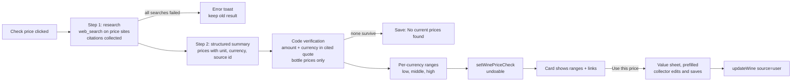

# Check Price and the Wine Guide Card - Plan

## Goal Capsule

- **Objective:** A collector can see, on one wine page, a sourced shop-price range for that exact wine and choose to use it as their value, next to the wine's profile and critics' views in one compact card.
- **Means:** Reuse the two-step web research pattern of What critics say for prices (KTD1, KTD2), and merge the three AI sections into one card with stacked sections (KTD5).
- **Authority:** This plan's Requirements win on product behavior; KTDs win on mechanism. The existing rule that only the collector sets a value is never weakened.
- **Stop conditions:** Stop and report if a price could reach the wine's value without a collector action, or if merging the cards would drop an existing behavior or accessible name that a test relies on and has no equivalent.
- **Execution profile:** Standard. Seven units, U1 to U7, mostly sequential; U5 depends on U3 and U4.
- **Finish and ship:** `ce-work` implements and verifies locally; the calling `lfg` run reviews, commits, pushes to `claude/brave-darwin-8bftxa`, and builds the user's zip.

---

## Product Contract

### Summary

Add Check price: on demand, Claude searches a fixed list of price sites for one wine and the app shows a verified price range per currency with a link to each source. A Use this price button opens a value sheet with the middle of the range filled in, and only the collector saves it. Merge About this wine, What critics say, and the new prices into one card on the wine page.

### Problem Frame

Collectors want a current market reference when they record what a wine is worth, but there is no free, legal live price feed. Today they must look prices up elsewhere and type them in. The wine page also shows two separate AI cards stacked in a narrow side column, and the user asked for them to sit together in one footprint.

### Key Decisions

- **Prices are an on-demand, sourced reference; only the collector sets the value.** (session-settled: user-approved — chosen over a live market price feed or AI setting the value automatically: no free, legal live price source exists, and the app's rule is that only the collector sets a value.) Governs R1, R6, R7.
- **A price shows only when that exact price appears in text quoted from the linked page.** (session-settled: user-approved — chosen over showing model-reported prices without verification: prevents invented prices, matching how critic scores are verified.) Governs R3, R4.
- **Prices are never converted between currencies.** (session-settled: user-approved — chosen over converting to the collector's currency: avoids exchange-rate errors.) Governs R5.
- **About this wine and What critics say share one card.** (session-settled: user-directed — chosen over two separate stacked cards: the user asked for them in one window that fits together.) Governs R9, R10.
- **The value tracker with graphs is out of scope.** (session-settled: user-directed — chosen over building the tracker now: the user set that idea aside.) See Scope Boundaries.

### Requirements

**Check price**

- R1. A Check price action on the wine page runs a price search for that wine only when the collector asks, and shows a cost note before the first run.
- R2. The search covers that exact producer, wine name, vintage (or NV), and bottle size, using only the fixed price-site list (KTD3), with at most 5 searches.
- R3. A price is kept only when its amount and currency appear in a quote cited from the same page; every other price is dropped.
- R4. When no price survives, the result reads "No current prices found", and a search that failed is reported as an error, never saved as "not found".
- R5. Prices are grouped by currency, each group shows its low, middle, and high bottle price, and no amount is converted.
- R6. The result shows each source as a link, the date of the check, and a note that shop prices are often above auction or collector prices.
- R7. Use this price opens a value sheet with the middle bottle price and its currency filled in, shows any value it would replace, and changes nothing until the collector saves.
- R8. A result checked for a different producer, name, vintage, or bottle size than the wine has now is marked out of date, and Use this price is hidden for it.

**One card**

- R9. Profile, critics, and prices sit in one card on the wine page with one heading, and each section keeps its own actions, states, and undo.
- R10. Every existing behavior of About this wine and What critics say stays, including no-key and offline notes, double-click protection, refresh, remove, and undo.

**Data safety**

- R11. Saving, refreshing, or removing a price result is one undoable change, and the result survives backup, restore, and merge.

### Acceptance Examples

- AE1. Covers R3. **Given** a cited quote "Ridge Monte Bello 2019 £225.00 per bottle" from bbr.com, **when** the summary reports £225 from that source, **then** the price is kept; a reported £250 from the same quote is dropped, and "250" never matches inside "1,250".
- AE2. Covers R5, R7. **Given** verified bottle prices £200, £225, and £240 plus $310 from wine.com, **when** the card shows them, **then** it shows a GBP range £200 to £240 with middle £225 and a separate USD line, and Use this price is offered per currency.
- AE3. Covers R8. **Given** a result checked for vintage 2019, **when** the collector edits the wine to 2018, **then** the card says the prices were checked for 2019 and hides Use this price.
- AE4. Covers R4. **Given** every web search returns an error, **when** the check ends, **then** an error toast shows and any earlier result stays unchanged.

### Scope Boundaries

- No live or background price updates; a check runs only when asked.
- No currency conversion and no price history over time.
- The sommelier does not get a price tool in this change.

#### Deferred to Follow-Up Work

- The value tracker with graphs and what-if controls.
- A collector-editable list of price sites.
- Measuring, with a real API key, how often verified prices survive the citation check (see Risks).

---

## Planning Contract

### Key Technical Decisions

- KTD1. **Share one web-research helper.** Move the web search tool builder (including the `web_search_20250305` choice for Haiku), the pause_turn resume loop, citation collection, and source numbering out of `src/ai/features/criticsConsensus.ts` into a shared module, so critics and prices use one tested path. Critics behavior must not change.
- KTD2. **A dedicated price matcher, not the score matcher.** Parse amounts with a currency symbol or ISO code, thousands separators, and decimal commas, and match the whole amount, so "250" never matches inside "1,250" or "$2,500". Instantiates the verification Key Decision (R3); inherits its label: (session-settled: user-approved — chosen over showing model-reported prices without verification: prevents invented prices).
- KTD3. **A fixed price-site list in one constant.** Start with wine-searcher.com, bbr.com, farrvintners.com, justerinis.com, thewinesociety.com, majestic.co.uk, millesima.com, wine.com, klwines.com, and totalwine.com, passed as `allowed_domains`. Each entry records the currency a bare "$" means on that site: USD for wine.com, klwines.com, and totalwine.com, and none for the others.
- KTD4. **The summary step labels each price.** Its structured output gives, for each price as written: amount, currency, unit (bottle, case, or unknown), bottle size (ml, or unknown), vintage, basis (duty-paid retail, in bond or ex-tax, aggregate average, or unknown), availability (for sale, sold out, or unknown), merchant, and source id. A price forms the range only when all of these hold:
  1. Unit is bottle, availability is for sale or unknown, and basis is duty-paid retail or unknown.
  2. Its vintage matches the wine, and the quote holding the amount shows no other four-digit year.
  3. Its size matches the wine's bottle size; an unknown size counts only for a 750 ml wine.
  Every other verified price is shown as an other listing and never feeds Use this price.
- KTD5. **One card with stacked sections, not tabs.** `src/components/ui/Tabs.tsx` renders only the active panel, so switching tabs would unmount a section and cancel its running request, and three tabs do not fit the 20 rem side column. One card shell holds three section components, each keeping its own state. Instantiates the one-card Key Decision (R9); inherits its label: (session-settled: user-directed — chosen over two separate stacked cards: the user asked for one window).
- KTD6. **Store the identity the check ran for.** The saved result records producer, name, vintage, and bottle size; the card compares them with the live wine for R8.
- KTD7. **Use this price goes through the collector's own value write.** A value-only sheet built on `src/features/wine/ValueFields.tsx` saves through `updateWine` as source "user", so `applyValueEdit` in `src/domain/commands/wines.ts` keeps refusing any other source. Only an ISO currency can fill the value: an ISO code, an unambiguous symbol (£ as GBP, € as EUR, CHF), or a bare "$" from a site whose KTD3 entry declares USD, or written "US$". Any other bare "$" or "¥" is shown in its own symbol group, is not merged into USD, and is not offered. Instantiates the value Key Decision (R7); inherits its label: (session-settled: user-approved — chosen over AI setting the value automatically: only the collector sets a value).
- KTD8. **Store per-currency ranges computed at save time.** Low, middle (median of verified bottle prices), and high are computed once in code from verified prices and saved with them, so the card never recomputes from stale inputs.

### High-Level Technical Design

### Assumptions

- Citation quotes from the web search tool are up to 150 characters, so many real prices may not survive R3; the research prompt asks Claude to quote the exact text that holds each price, which raises survival. This is workable, not invalidating, for the verification Key Decision.
- The price sites in KTD3 allow search access; any site that blocks it simply returns no prices.
- The section names in the one card are "Profile", "What critics say", and "Shop prices", under the card heading "About this wine".
- The release version is 1.4.0.

### Sequencing

U1 first, so critics keep passing on the shared helper. U2 and U4 can follow in either order. U3 needs U1 and U2. U5 needs U3 and U4. U6 needs U5. U7 last.

---

## Implementation Units

### U1. Shared web-research helper

- **Goal:** One module that runs a web-search research turn and returns texts, citations, search results, and errors.
- **Requirements:** R2, R4 (supports KTD1)
- **Dependencies:** none
- **Files:** `src/ai/features/webResearch.ts` (new), `src/ai/features/webResearch.test.ts` (new), `src/ai/features/criticsConsensus.ts`, `src/ai/features/criticsConsensus.test.ts`
- **Approach:**
  1. Move the tool builder, the pause_turn loop with `MAX_RESUMES`, citation and search-result collection, and http(s)-only source numbering into the new module, taking the domain list and prompts as inputs.
  2. Also return the number of searches that succeeded, and do not count `max_uses_exceeded` as a failed search.
  3. Make `criticsConsensus.ts` call it, with no change to what it sends or returns.
- **Patterns to follow:** the current private helpers in `src/ai/features/criticsConsensus.ts`; fake blocks in `src/ai/fake.ts` (`fakeWebSearch`, `fakeCitedText`).
- **Test scenarios:**
  - A research turn with two cited texts returns both citations with url, title, and quote.
  - A pause_turn reply is resumed by sending the assistant content back, and stops after 3 resumes.
  - A search result whose content is an error object is reported as an error, not a source.
  - A `max_uses_exceeded` error after five good searches counts five successes and no failure.
  - Haiku gets the `web_search_20250305` tool; other models get `web_search_20260209`.
  - Every existing critics test passes unchanged.
- **Verification:** critics tests green with no edits to their expectations; new helper tests green.

### U2. Price matcher and range maths

- **Goal:** Pure functions that verify a price against a quote and build per-currency ranges.
- **Requirements:** R3, R5 (KTD2, KTD8)
- **Dependencies:** none
- **Files:** `src/ai/features/priceMatch.ts` (new), `src/ai/features/priceMatch.test.ts` (new)
- **Approach:**
  1. Parse a price into amount and currency from symbols (£, €, $, ¥, CHF) or ISO codes, with thousands separators and decimal commas.
  2. A price matches a quote only when the same amount and a matching currency mark appear in it as a whole number; prefixed dollars (A$, C$, HK$, NZ$, S$) never match a "$" or USD price.
  3. Resolve a bare "$" to USD only per KTD7.
  4. Build ranges per currency from range-eligible prices (KTD4): low, median as middle, high, and count.
- **Test scenarios:**
  - Covers AE1. "£225.00" matches in "Ridge Monte Bello 2019 £225.00 per bottle"; "£250" does not.
  - "250" does not match inside "1,250", "$2,500", or "2501".
  - "1.250,00 €" and "€1,250" both parse as 1250 EUR.
  - A price in USD does not match a quote that shows only "£".
  - "$310" from wine.com resolves to USD; "$310" from bbr.com stays a "$" symbol group; "$310" does not match inside "HK$310".
  - Covers AE2. Ranges for £200, £225, £240 and $310 from wine.com give GBP low 200, middle 225, high 240, and a USD range of one price.
  - An even count gives the median of the middle two.
- **Verification:** all matcher tests green, including the substring cases.

### U3. Price check feature

- **Goal:** `checkPrice(wine)` runs research and summary and returns a verified result.
- **Requirements:** R2, R3, R4, R5 (KTD3, KTD4)
- **Dependencies:** U1, U2
- **Files:** `src/ai/features/priceCheck.ts` (new), `src/ai/features/priceCheck.test.ts` (new), `src/ai/usage.ts`
- **Approach:**
  1. Send only identity fields (producer, name, vintage, bottle size, region, country), fenced with "<" escaped as `wineProfile.ts` does.
  2. Research with the U1 helper on `PRICE_SITES`, asking Claude to quote the exact text holding each price and to treat web content as data.
  3. Summarise with `runStructuredWithModel` (no tools, effort "low") into the KTD4 shape, then verify with U2 and keep only listed http(s) sources.
  4. Throw an AI error when no search succeeded, or when any search failed and no price survived (R4); return "found: false" only when every search that ran succeeded and nothing survived.
  5. Add the usage label "price" → "Check price".
- **Patterns to follow:** `src/ai/features/criticsConsensus.ts` (`researchCritics`, `verifyCritics`, `generateWineCritics`).
- **Test scenarios:**
  - A fake run with a cited £225 bottle price returns a GBP range with one source.
  - A summary price not present in any cited quote is dropped.
  - A case price is kept as an other listing and left out of the range.
  - A cited magnum price for a 750 ml wine, a 2018 price for a 2019 wine, and an in-bond price are each kept as other listings and left out of the range.
  - One failed search plus empty results throws; five good searches plus `max_uses_exceeded` with nothing verified returns "found: false".
  - A bare "$" price from a site with no declared currency is kept for display but marked not usable for the value.
  - Covers AE4. All searches erroring throws, and nothing is returned for saving.
  - The request contains no lot, price paid, note, or location data.
  - Abort during research stops the run without a result.
- **Verification:** feature tests green using the fake AI only.

### U4. Stored result and command

- **Goal:** Save, replace, and remove a price result on the wine as one undoable change.
- **Requirements:** R6, R8, R11 (KTD6, KTD8)
- **Dependencies:** none
- **Files:** `src/domain/types.ts`, `src/domain/commands/winePriceCheck.ts` (new), `src/domain/commands/winePriceCheck.test.ts` (new), `src/domain/commands/registry.ts`, `src/domain/commands/index.ts`, `src/ai/sommelier/tools.ts`, `src/domain/commands/merge.ts`, `src/domain/commands/merge.test.ts`
- **Approach:**
  1. Add an optional, nullable `priceCheck` on the wine: checked-for identity, ranges, listings with source, found flag, generated date, and model.
  2. Add `setWinePriceCheck` like `setWineCritics`, listed in `CHAT_HUMAN_ONLY` with a reason.
  3. Add `priceCheck` to merge's fillable fields, and treat a "found: false" result as empty for both `priceCheck` and `critics`, so a real result from the merged wine is kept.
- **Patterns to follow:** `src/domain/commands/wineCritics.ts` and its test.
- **Test scenarios:**
  - Saving a result then undoing restores the wine exactly.
  - Removing then undoing brings the result back.
  - A deleted or missing wine is refused.
  - A backup without `priceCheck` still parses, and one with it round-trips.
  - Merging keeps the merged wine's real result when the kept wine has a "found: false" result.
- **Verification:** command, merge, backup, and sommelier parity tests green.

### U5. One card on the wine page

- **Goal:** One card titled "About this wine" with Profile, What critics say, and Shop prices sections.
- **Requirements:** R1, R6, R8, R9, R10 (KTD5)
- **Dependencies:** U3, U4
- **Files:** `src/features/wine/WineGuideCard.tsx` (new), `src/features/wine/WineGuideCard.test.tsx` (new), `src/features/wine/AboutWineCard.tsx`, `src/features/wine/CriticsCard.tsx`, `src/features/wine/PriceSection.tsx` (new), `src/features/wine/PriceSection.test.tsx` (new), `src/features/wine/AboutWineCard.test.tsx`, `src/features/wine/CriticsCard.test.tsx`, `src/features/wine/index.tsx`, `e2e/collector.spec.ts`
- **Approach:**
  1. Turn the two cards into section components without their own card shell, with `h3` section headings under one `h2`; the inner subheadings ("Pairs well with", "Scores") become `h4`.
  2. Show the AI status note once at the top of the card.
  3. Give each section's buttons distinct names, for example "Remove profile", "Remove critics summary", and "Remove prices".
  4. Add the Shop prices section with a double-click guard, links that open in a new tab, the cost note, and the shop-price note. It shows:
     - one row per currency, for example "GBP £200 to £240, middle £225 (3 prices)", or one amount when the currency has one price;
     - Use this price directly under its row (U6);
     - below the rows, "Other listings": merchant, amount as written, unit, size, and availability, each linked to its source;
     - for an out-of-date result, the rows stay visible under a line such as "Checked for 2019; this wine is now 2018", with Refresh available.
  5. Render the card with `key={wine.id}` in the wine page's side column in place of the two cards.
- **Patterns to follow:** `src/features/wine/CriticsCard.tsx` states and link rules.
- **Test scenarios:**
  - The card has one `h2`, exactly three `h3` section headings, the inner subheadings at `h4`, and the AI note once.
  - Without a key, all three actions are disabled with the "Needs AI key" note.
  - Writing a profile, then removing it and undoing, still works inside the card.
  - Finding critics still works, with the score shown only when verified.
  - Check price shows the GBP range, the date, and a link per source.
  - Covers AE3. A result for vintage 2019 on a wine now 2018 is marked out of date and has no Use this price.
  - A double click on Check price sends one research request.
  - A "found: false" result shows "No current prices found".
  - The e2e About this wine journey passes with the new button names.
- **Verification:** wine tests, the a11y spec, and the collector e2e spec are green.

### U6. Use this price

- **Goal:** A value sheet prefilled from a price range that only the collector saves.
- **Requirements:** R7 (KTD7)
- **Dependencies:** U5
- **Files:** `src/features/wine/SetValueSheet.tsx` (new), `src/features/wine/SetValueSheet.test.tsx` (new), `src/features/wine/PriceSection.tsx`
- **Approach:**
  1. Offer Use this price per currency range whose currency is usable under KTD7, on a wine that is not sample data and whose result is not out of date. Where it is withheld, the row shows a short reason instead: "Currency unclear. Enter your value in Edit wine." or "Sample wine. Prices can't be used as a value."
  2. The sheet shows the current value when one exists, lets the collector edit amount and currency, and saves through `updateWine`; Cancel changes nothing.
  3. Saving the same value as now closes the sheet without a change.
- **Patterns to follow:** `src/features/wine/ValueFields.tsx`, `src/features/wine/value.ts`, and `src/features/wine/SheetForm.tsx`.
- **Test scenarios:**
  - Covers AE2. Use this price on the GBP range opens the sheet with 225 and GBP.
  - Saving sets the value with source "user", and undo restores the old value.
  - Cancel leaves the value unchanged.
  - The sheet shows "Replaces £180" when a value exists.
  - A sample wine and an out-of-date result show no Use this price, and the sample wine shows its reason line.
  - The price check result itself never changes the value without the sheet.
- **Verification:** sheet tests green; the existing value tests still pass.

### U7. Docs, release notes, and e2e mock

- **Goal:** Help, privacy, release notes, version 1.4.0, and a mocked e2e journey for Check price.
- **Requirements:** R1, R6
- **Dependencies:** U6
- **Files:** `src/content/help.ts`, `docs/SETUP.md`, `src/content/changelog.ts`, `src/content/changelog.test.ts`, `src/features/whats-new/WhatsNew.test.tsx`, `package.json`, `package-lock.json`, `e2e/anthropicMock.ts`, `e2e/collector.spec.ts`
- **Approach:**
  1. Help and privacy name Check price and say only the wine's identity goes to Anthropic, which uses it to search price sites.
  2. Add the 1.4.0 changelog entry and bump the version in both version fields.
  3. Teach the e2e mock to return web search and cited text blocks, and add a Check price journey that ends with Use this price saving a value.
- **Test scenarios:**
  - The changelog test finds 1.4.0 first and keeps 1.3.0.
  - The e2e journey checks a price, opens the sheet, saves, and sees the new value on the wine page.
- **Verification:** unit and e2e suites green.

---

## Verification Contract

| Gate | Command | Applies to |
| --- | --- | --- |
| Types, lint, unit tests | `npm run check` | every unit |
| Build | `npm run build` | before handing back |
| Browser journeys | `npx playwright test` | U5, U7 |
| Launchers on Mac and Windows | CI `launcher` jobs on push | final |

No test may call the real Anthropic API; all AI behavior uses `src/ai/fake.ts` or `e2e/anthropicMock.ts`.

## Definition of Done

- Every unit's test scenarios exist and pass, and the full Verification Contract is green.
- No path lets a price change the wine's value without the collector saving the sheet.
- What critics say and About this wine behave as before inside the one card.
- Abandoned or experimental code from the run is removed.

---

## Risks & Dependencies

| Risk | Mitigation |
| --- | --- |
| Short citation quotes (up to 150 characters) leave many prices unverified, so "No current prices found" is common. | The prompt asks for the exact price text to be quoted; measure survival with `npm run eval:ai` once a key is available (deferred). |
| Price sites block or paywall search access. | The fixed list includes several merchants; a blocked site only lowers coverage. |
| A verified amount is the wrong kind of price (case, magnum, other vintage, sold out, in bond, or an aggregate average). | KTD4 labels each and keeps all of them out of the range; the shop-price note stays visible. |
| Renaming buttons breaks existing tests or the e2e journey. | U5 updates those tests in the same unit. |

## Sources & Research

- `src/ai/features/criticsConsensus.ts` — the two-step pattern, `CRITIC_SITES`, `verifyCritics`, and `scoreAppearsIn` (not reused for prices because it matches inside larger numbers).
- `src/domain/commands/wines.ts` `applyValueEdit` — refuses any value write whose source is not "user".
- `src/components/ui/Tabs.tsx` — renders only the active panel.
- Claude web search tool docs: citations carry `cited_text` of up to 150 characters; structured output can not be combined with citations.
